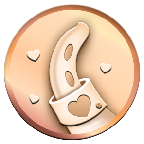
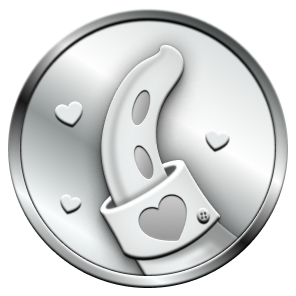
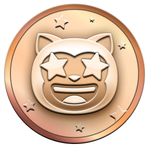
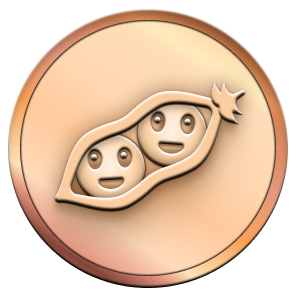

# 🏅 GitHub Achievements 
## Conquistas no GitHub

  

  Esse repositório contém todas as conquistas (<i>Achivements</i>) que você pode ter no seu GitHub!  
  Já favorita esse repo ⭐ para não perder nenhuma novidade!

 

# Atualizações
* (10/01/2023) Archievements agora aparecem na versão mobile também
* (07/10/2022) Possibilidade de ocultar seus Archievements

* (09/06/2022) Github Archievements é lançado!
 

# Lista de Conquistas
 

| Medalha | Nome | Como conseguir | Quantidade necessária | 
| :-: | :-: | :-: | :-: |
|  | Heart On Your Sleeve | Ainda um mistério   (se você descobrir me conta!) | <table>  <thead>  <tr>  <th>Padrão</th> <th>Bronze</th>  <th>Prata</th>  <th>Ouro</th>  </tr>  </thead>  <tbody>  <tr>  <td align="center"></td>   <td></td>  <td></td>  <td></td>  </tr>  </tbody>  </table> |
|  | Open Sourcerer | Ainda um mistério   (se você descobrir me conta!) | <table>  <thead>  <tr>  <th>Padrão</th> <th>Bronze</th>  <th>Prata</th>  <th>Ouro</th>  </tr>  </thead>  <tbody>  <tr>  <td align="center"></td>   <td></td>  <td></td>  <td></td>  </tr>  </tbody>  </table> |
|                  | Starstruck         | Criar um repositório que tenhha várias ⭐ | <table>  <thead>  <tr>  <th>Padrão</th> <th>Bronze</th>  <th>Prata</th>  <th>Ouro</th>  </tr>  </thead>  <tbody>  <tr>  <td align="center"></td>   <td></td>  <td></td>  <td></td>  </tr>  <tr>  <td align="center">16</td>  <td align="center">128</td>  <td align="center">512</td>  <td align="center">4096</td>  </tr>   </tbody>  </table>      |
|                  | Quickdraw        | Seja rápido!  Fechar uma issue ou pull request em menos de 5 minutos | <table>  <thead>  <tr>  <th>Padrão</th>  </tr>  </thead>  <tbody>  <tr>  <td></td> </tr>     </tbody>  </table> |
|      | Pair Extraordinaire  | Co-autor com commmits em um pull request mergeada | <table>  <thead>  <tr>  <th>Padrão</th> <th>Bronze</th>  <th>Prata</th>  <th>Ouro</th>  </tr>  </thead>  <tbody>  <tr>  <td align="center"></td>   <td></td>  <td></td>  <td></td>  </tr>  <tr>  <td align="center">1</td>  <td align="center">10</td>  <td align="center">24</td>  <td align="center">48</td>  </tr>   </tbody>  </table>      |
|      | Pull Shark  | Ter pull requests mergeadas | <table>  <thead>  <tr>  <th>Padrão</th> <th>Bronze</th>  <th>Prata</th>  <th>Ouro</th>  </tr>  </thead>  <tbody>  <tr>  <td align="center"></td>   <td></td>  <td></td>  <td></td>  </tr>  <tr>  <td align="center">2</td>  <td align="center">16</td>  <td align="center">128</td>  <td align="center">1024</td>  </tr>   </tbody>  </table>      |
|  | Galaxy Brain | Responder uma discussão  (e receber uma resposta) | <table>  <thead>  <tr>  <th>Padrão</th> <th>Bronze</th>  <th>Prata</th>  <th>Ouro</th>  </tr>  </thead>  <tbody>  <tr>  <td></td>  <td></td>  <td></td>  <td></td>  </tr>  <tr>  <td align="center">2</td> <td align="center">8</td>  <td align="center">16</td>  <td align="center">32</td>  </tr>   </tbody>  </table>
|                  | YOLO        | ViD4 L0k4   Mergear um pull request sem code review | <table>  <thead>  <tr>  <th>Padrão</th>  </tr>  </thead>  <tbody>  <tr>  <td></td> </tr>  </tbody>  </table> |
|                  | Public Sponsor        | Patrocinar alguma conta do GitHub por meio do GitHub Sponsors   [Patrocina eu! 🤩](https://github.com/sponsors/AdrianaSaty)| <table>  <thead>  <tr>  <th>Padrão</th>  </tr>  </thead>  <tbody>  <tr>  <td></td> </tr>  </tbody>  </table> |

 